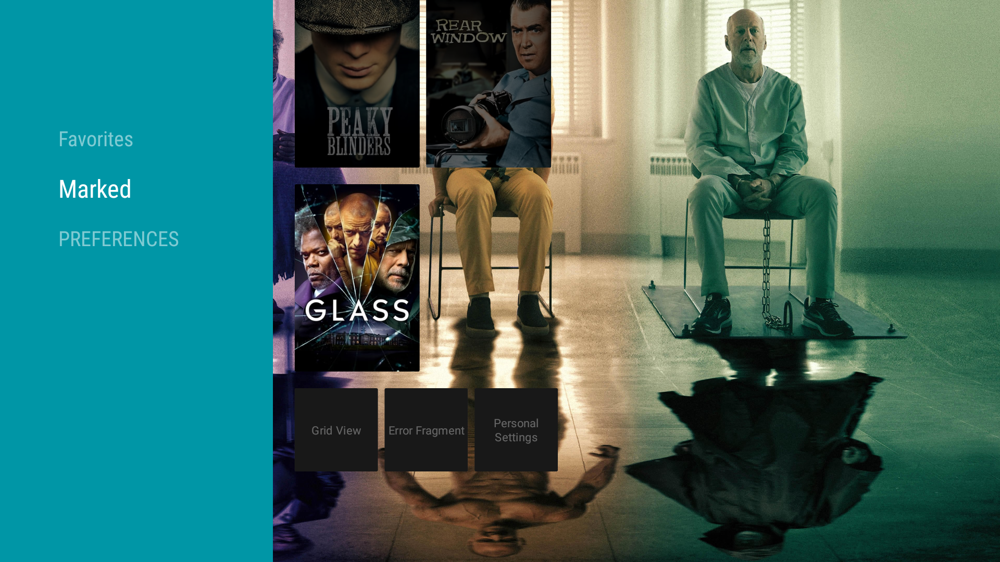
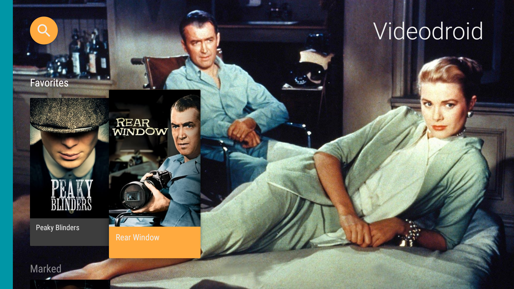
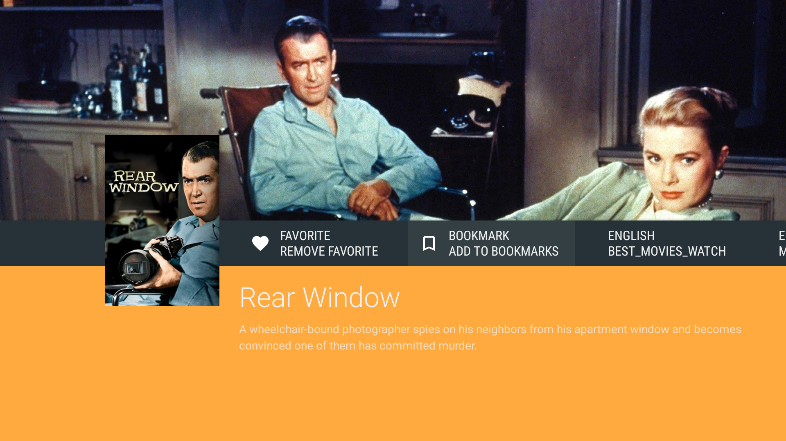
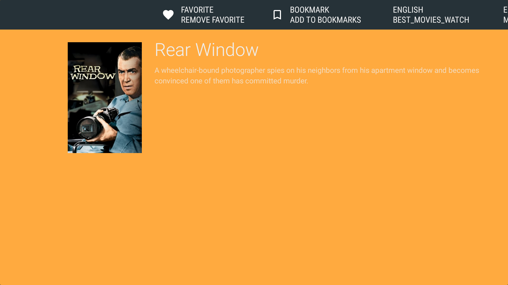

# Viddroid

##### An Android-TV application with scrapes various websites

###### Note: This project is for educational purposes only, use at your own risk.

### Screenshots

### Libraries used

- [JSON](https://mvnrepository.com/artifact/org.json/json) to decode & encode JSON data
- [JSOUP](https://mvnrepository.com/artifact/org.jsoup/jsoup) to parse HTML
- [Exoplayer](https://github.com/google/ExoPlayer) to play the content
- [Exoplayer leanback]() required for exoplayer to work on Android-TV